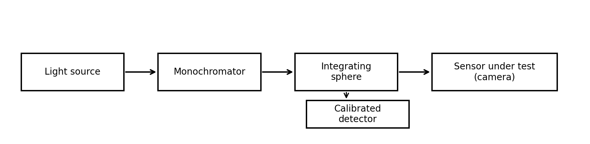
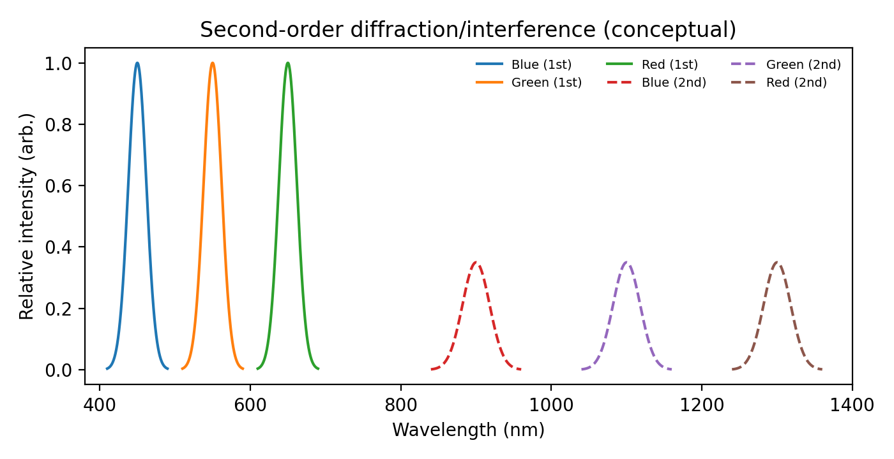
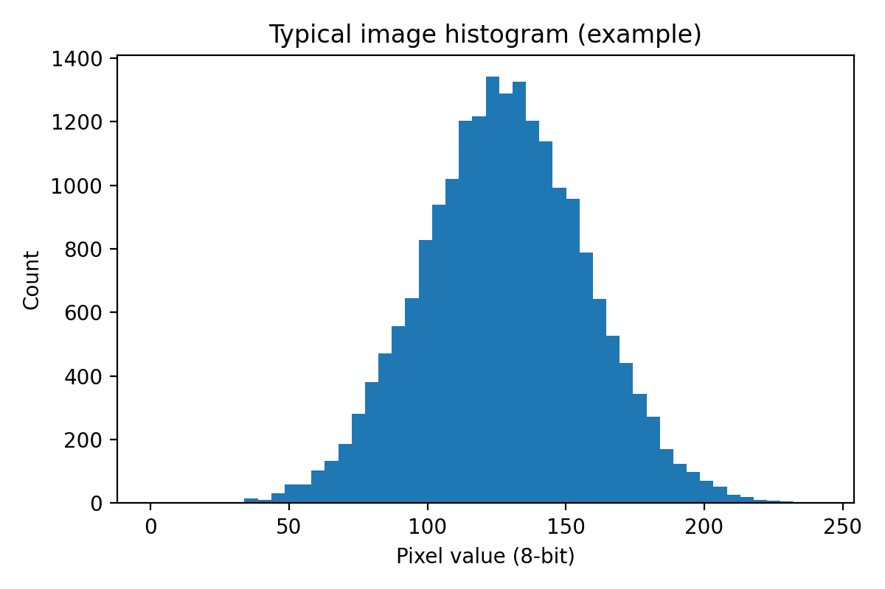
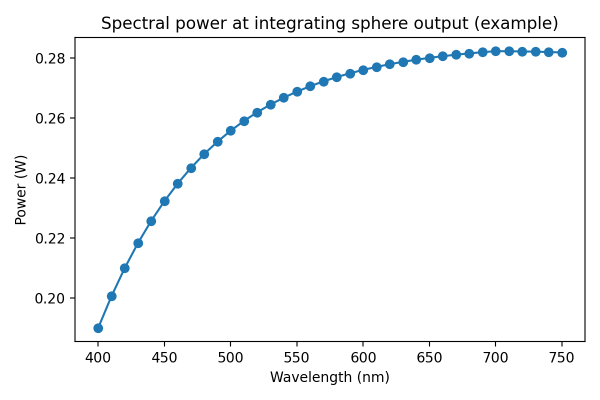
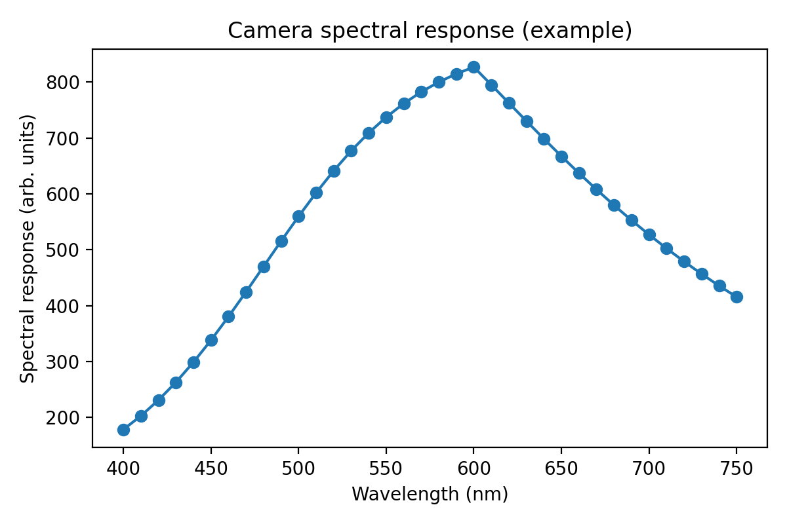
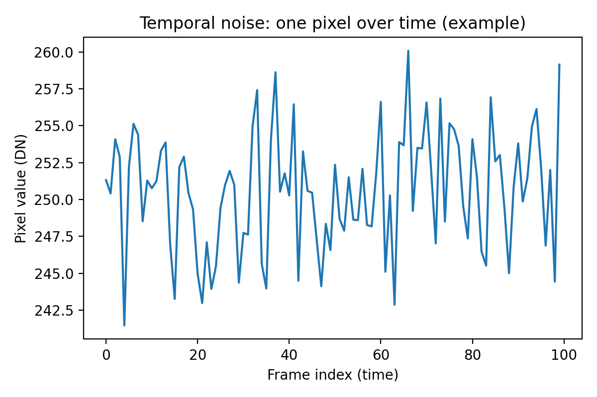
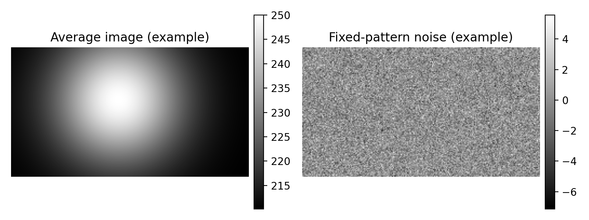
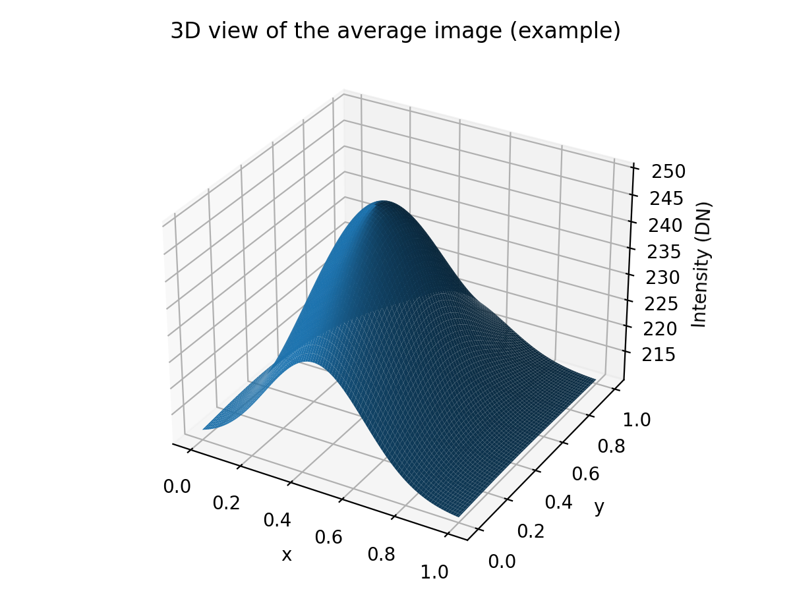

# Lab Report (English)
## Characterization of Optical Sensors: Spectral Response & Noise

**Course / Track:** Bio-Inspired Vision — Sorbonne Université (Master *Sciences de l’Ingénieur*, ISI)  
**Academic year:** 2024–2025  
**Students (Group A+B):** Edouard David, Massin Assoul, Jessy Azizi, Haitem Bensalah, Amir Wail Bouhedja, Tony Cao, Benjamin Dukatar, Mohamed Mammeri

---

## 1. Introduction

This lab investigates:
1) the **spectral response** of an image sensor (CMOS or CCD-type), and  
2) the sensor’s **noise**, focusing on **temporal noise** and **spatial (fixed-pattern) noise**.

Measurements were performed using the **Synergie** software with a dedicated optical bench.

---

## 2. Background

### 2.1 How to recognize a CMOS vs CCD sensor (qualitative)

- **CMOS sensors** often integrate analog + digital circuitry close to (or within) the pixel matrix, which can make the structure look more complex and “busy”.
- **CCD sensors** typically have a cleaner-looking matrix because much of the supporting circuitry is outside the pixel array; the surface can appear reflective/metallic due to fabrication materials.

**Market note (general):** CCDs are more common in high-end imaging contexts requiring very high image quality, while CMOS sensors are widely used due to lower cost and versatility.

### 2.2 Monochrome vs color sensor

- **Monochrome sensors:** each pixel measures intensity only.
- **Color sensors:** use a **Bayer color filter array** so each pixel measures one channel (R/G/B). An **IR-cut filter** is commonly added to reduce near-infrared contamination that could distort colors.

---

## 3. Spectral response study

### 3.1 Calibrated detector and spectral responsivity

A calibrated silicon photodiode (UDS100 type) is used as a reference detector. The measured electrical signal (current *I* or voltage *V*) is converted to optical power using the detector’s spectral responsivity.

### 3.2 Measurement bench (monochromator + integrating sphere)

A broadband light source is spectrally selected by a **monochromator** and injected into an **integrating sphere** to produce a spatially uniform output. A **calibrated detector** measures the emitted optical power and a **camera under test** records images at the sphere’s output.

*(For comparison: see the extracted original schematic in `figures/original/`.)*

### 3.3 Second-order interference

When observing the monochromator output, **second-order diffraction/interference** can create responses beyond the visible range (e.g., detecting signals above ~750 nm in the near-infrared). The figure below is a conceptual remake:

### 3.4 Exposure time settings

The wavelength range was limited to the visible region (roughly 400–700 nm) and camera parameters (exposure time, frame rate) were adjusted to avoid saturation and keep the histogram centered.

### 3.5 Spectral response acquisition and processing

For each wavelength in the range **400–750 nm** (step 10 nm), ~**30 images** were recorded.

The optical power at the integrating sphere output can be computed from the reference detector:

\[
\Phi_{\mathrm{out}}(\lambda) = \frac{I_1(\lambda)}{R_{\mathrm{dc,UDS100}}(\lambda)}
\]

#### Remade Figure 4 — Optical power vs wavelength (example)

#### Remade Figure 5 — Camera spectral response (example)

The camera response is obtained by averaging the captured images at each wavelength and plotting the resulting response versus wavelength.

**Qualitative observation:** the response peaks around the green/yellow region (~550–600 nm), and decreases toward the infrared, consistent with sensors optimized for visible light.

---

## 4. Noise study

### 4.1 Temporal noise

Temporal noise can be visualized by tracking a single pixel value over time (across many frames). In the original report, variations on the order of ±10 DN were observed.

### 4.2 Spatial noise (fixed-pattern noise)

To isolate spatial fixed-pattern noise:
1) compute the **average image** over ~100 frames,  
2) subtract this average from a reference frame to highlight fixed spatial variations.

### 4.3 3D visualization of the average image

A 3D surface representation helps visualize the intensity profile (e.g., the sphere-like shape observed).

---

## 5. Conclusion

This study measured the **spectral response** of a camera using a monochromator + integrating sphere test bench, and analyzed **temporal** and **spatial** noise using averaging and subtraction methods. The results highlight the importance of careful calibration and image processing to obtain reliable optical measurements.

---

## Appendix — Wavelength observations

See: `data/annex_wavelength_observations_en.csv`
